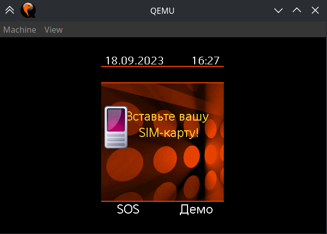

# What is this?
This is a hardware emulator for any boards with pmb8875/pmb8876 CPU, mostly legendary Siemens phones.
The current state is very early alpha with many bugs and most hardware unimplemented. :)

# Installation
- Windows: download from [Releases](https://github.com/Azq2/pmb887x-emu/releases).
- ArchLinux: `yay -S pmb887x-emu`
- OSX: `brew install siemens-mobile-hacks/tap/pmb887x-emu` or download from [Releases](https://github.com/Azq2/pmb887x-emu/releases).
- Build from sources:
  ```bash
  sudo apt-get build-dep qemu # Ubuntu or Debian
  sudo apt-get install libcacard-dev

  git clone --recurse-submodules --shallow-submodules --depth 1 https://github.com/siemens-mobile-hacks/pmb887x-emu
  cd pmb887x-emu

  cmake -B build
  cmake --build build -j$(nproc)
  sudo cmake --install build
  # or sudo cmake --install build --prefix /opt/pmb887x-emu
  ```

# Usage
```
Usage: pmb887x-emu [--help] [--version] --device VAR --fullflash VAR [--rw] [--flash-otp0 VAR] [--flash-otp1 VAR] [--flash-otp0-file VAR] [--flash-otp1-file VAR] [--flash-efa-file VAR] [--siemens-esn VAR] [--siemens-imei VAR] [--sim VAR] [--sim-reader-name VAR] [--sim-imsi VAR] [--sim-operator VAR] [--serial VAR] [--usartd] [--wait-for-serial] [--gdb] [--trace VAR] [--trace-io VAR] [--trace-log VAR] [--qemu-monitor VAR] [--qemu-run-with-gdb] [--qemu-stop-on-exception] [--qemu-debug VAR]

Generic emulator for PMB887X-based mobile phones.

Optional arguments:
  -h, --help                    shows help message and exits 
  -v, --version                 prints version information and exits 

Main options (detailed usage):
  -d, --device                  Device name or path to custom device.cfg file [required]
  -f, --fullflash               Path to the fullflash.bin file [required]
  --rw                          Allow writing to fullflash.bin (dangerous!) 

OTP options (detailed usage):
  --flash-otp0                  Raw NOR flash otp0 value in HEX (with lock bits) [nargs=0..1] [default: ""]
  --flash-otp1                  Raw NOR flash otp1 value in HEX (with lock bits) [nargs=0..1] [default: ""]
  --flash-otp0-file             Raw NOR flash OTP0 file [nargs=0..1] [default: ""]
  --flash-otp1-file             Raw NOR flash OTP1 file [nargs=0..1] [default: ""]
  --flash-efa-file              Raw NOR flash EFA file [nargs=0..1] [default: ""]
  --siemens-esn                 Siemens flash ESN (HEX) [nargs=0..1] [default: ""]
  --siemens-imei                Siemens flash IMEI (number) [nargs=0..1] [default: ""]

SIM options (detailed usage):
  --sim                         SIM source: virtual, none, or reader [nargs=0..1] [default: "virtual"]
  --sim-reader-name             Exact PC/SC reader name for --sim reader (uses the first reader with a card by default) [nargs=0..1] [default: ""]
  --sim-imsi                    Virtual SIM IMSI (15 decimal digits; derived from --sim-operator by default) [nargs=0..1] [default: ""]
  --sim-operator                Virtual SIM operator code as MCC+MNC (5 or 6 decimal digits) [nargs=0..1] [default: "00101"]

Serial options (detailed usage):
  --serial                      Connect host serial port to QEMU 
  --usartd                      Connect to usartd.pl in QEMU 
  -W, --wait-for-serial         Wait for first byte on serial port 

Trace options (detailed usage):
  --gdb                         Run firmware with GDB 
  -D, --trace                   CPU IO + CPU emulation log 
  --trace-io                    CPU IO tracing only 
  --trace-log                   CPU emulation logs only 

QEMU options (detailed usage):
  --qemu-monitor                QEMU monitor 
  --qemu-run-with-gdb           Run emulator using GDB (debug) 
  -E, --qemu-stop-on-exception  Stop QEMU on ARM exception 
  --qemu-debug                  QEMU debug options
```

**Some useful examples:**

1. Running fullflash with default emulator OTP
```
pmb887x-emu --fullflash EL71.bin --device siemens-el71
```

2. Running fullflash with your own ESN and IMEI
```
pmb887x-emu --fullflash EL71.bin --device siemens-el71 --siemens-esn=12345678 --siemens-imei=490154203237518
```

# OTP and EFA

OTP0, OTP1 and EFA are separate NOR flash regions outside the main array stored in the fullflash image.

With `--rw`, FLASH0 stores changes in raw sidecars next to the fullflash:

- `EL71.bin.cfi-otp0`
- `EL71.bin.cfi-otp1`
- `EL71.bin.cfi-efa`

Files are created on the first successful data change. A missing or empty file uses the initial value from `--flash-otp0`, `--flash-otp1`, `--siemens-esn` or `--siemens-imei`. A non-empty file overrides the initial value and must match the flash geometry. Without `--rw`, files are loaded but not changed.

Use `--flash-N-otp0-file`, `--flash-N-otp1-file` and `--flash-N-efa-file` to override paths for banks 0-3. FLASH0 also accepts the names without `-0`. Passing a file for an unsupported region is an error.

P.S. You can also use `./build/pmb887x-emu` instead of `pmb887x-emu` if you want to run it without installation.

# Real world example
Let's assume you have a fullflash. Of course, simply running commands from the examples won't work. :)

That's because Siemens mobile devices are paranoid and the firmware has hardware binding.

You have two options:

1. Recalculate keys in the firmware using the following steps: [docs/recalc-siemens-fullflash.md](docs/recalc-siemens-fullflash.md)
   
   Then run the emulator like this:
   ```
   pmb887x-emu --fullflash EL71.bin --device siemens-el71
   ```

2. Find the original ESN and IMEI from your phone and run the emulator like this:
   ```
   pmb887x-emu --fullflash EL71.bin --device siemens-el71 --siemens-esn=12345678 --siemens-imei=490154203237518
   ```

Once the emulator is running, you should first see the BENQ-Siemens boot screen and then something like this:



Don't worry, that's okay. :)

The virtual SIM is enabled by default. Use `--sim none` to disable it. Operator-locked firmware may require matching `--sim-operator` or `--sim-imsi`.

See [SIM card setup](docs/sim-card.md).

# Keyboard
You can press keys on the phone keyboard using your computer keyboard.

* Soft keys: Left: `F1`, Right: `F2`. Send/Start Call: `F3`. End Call: `F4`.
* Navigation (joystick): `Arrow keys`. Press navigation key: `Enter`.
* Number keys and `*` are mapped to NUM-keys. `#` is mapped to Numpad `/`.

The full key mapping is defined in [board.c](https://github.com/Azq2/qemu-pmb887x/blob/7c83c045a11cd110d220ec39a6cad3dbafe86e6c/hw/arm/pmb887x/boards.c#L19-L67).
rovements throughout

# Supported hardware
**Siemens SG2 platform**
| Phone              | Emulator     |
|--------------------|--------------|
| BenQ-Siemens E71   | siemens-e71  |
| BenQ-Siemens EL71  | siemens-el71 |
| BenQ-Siemens C1F0  | siemens-el71 |
| BenQ-Siemens CL61  | siemens-cl61 |
| BenQ-Siemens C81   | siemens-c81  |
| BenQ-Siemens M81   | siemens-m81  |
| BenQ-Siemens S68   | siemens-s68  |
| Siemens S75        | siemens-s75  |
| Siemens SL75       | siemens-sl75 |

**Siemens SGL platform**
| Phone              | Emulator     |
|--------------------|--------------|
| Siemens CX75       | siemens-cx75 |
| Siemens CX65       | siemens-cx65 |
| Siemens CX70       | siemens-cx70 |
| Siemens C72        | siemens-c72  |
| Siemens C75        | siemens-c75  |
