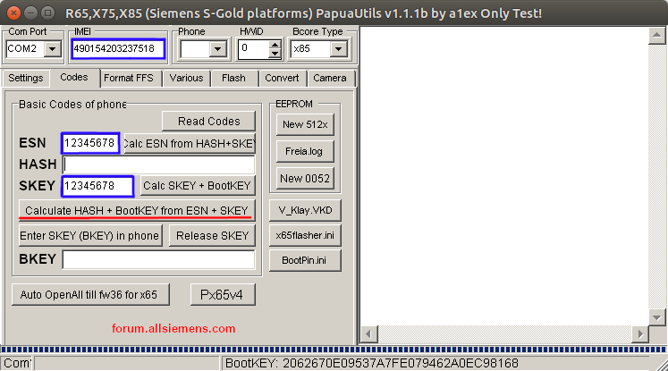
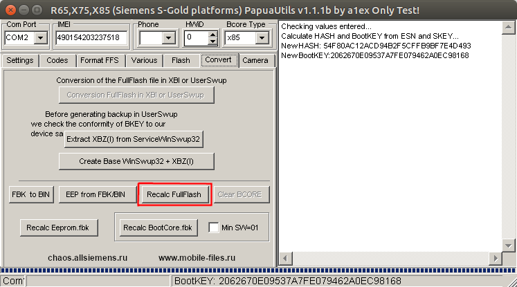

# Why is this needed?

Siemens Mobile is paranoid and all fullflashes have hardware binding to the NOR flash serial number.

You need to recalculate some keys in the fullflash before running it on the emulator.

# How do this?

This can be done with a few simple steps:

1. Download [x65PapuaUtils V1.1.1b](https://web.archive.org/web/20120711125854/http://forum.allsiemens.com/download.php?id=67331) (works fine in wine)
2. Go in tab "Codes" and enter this values:
    - **IMEI:** 490154203237518
    - **ESN:** 12345678
    - **SKEY:** 12345678
    
    
    
3. Press button "Calc HASH + BootKEY from ESN and SKEY".

3. Go in tab "Convert" and press button "Recalc Fullflash". In opened window select your input fullflash and output file.

    

5. Done. Now you can use new saved fullflash in the emulator.
