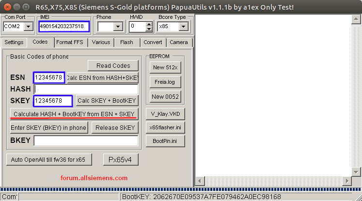
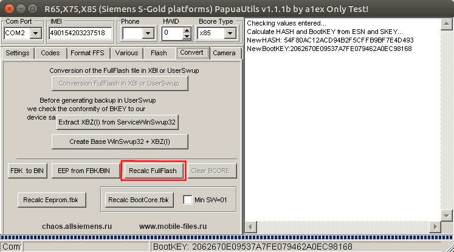

# Why is this needed?
Siemens Mobile is paranoid and all fullflashes have hardware binding to the NOR flash serial number.
The keys in the fullflash must match the ESN and IMEI of the (emulated) phone before it can boot.

# Automatic recalculation
Since the emulator knows which ESN and IMEI it presents to the firmware, it recalculates the keys
itself: on every start of a Siemens board the fullflash is checked and, if needed, patched
**in memory** (the file on disk is not modified unless --rw is specified).

```
pmb887x-emu --device siemens-s75 --fullflash S75.bin
```

The recalculation uses the emulator IMEI/ESN (`--siemens-imei`, `--siemens-esn`) and the service key
`12345678` (the value does not matter for the emulator, it only has to be consistent with the keys).
The algorithm is documented in [recalc-alogrithm.md](recalc-alogrithm.md).

Related options:

- `--siemens-no-recalc` disables the automatic recalculation and runs the fullflash as is.
- With `--rw` the fullflash file is the phone's flash, so the keys are recalculated **in the file** (only
  the affected bytes are rewritten). Use `--siemens-no-recalc` if you don't want that.

# Running a fullflash without touching it
A fullflash read from a real phone is already consistent with the ESN of that phone. Everything the
key check needs is stored in it except the ESN itself: the IMEI and the HASH in the bootcore, the SKEY
in EEPROM block 122 and the BootKey in EEPROM block 52.

So instead of rewriting the keys for the emulator ESN, the emulator can search for the ESN they were
built from and give that to the firmware:

```
pmb887x-emu --device siemens-s75 --fullflash S75.bin --siemens-recover-esn
```

This sweeps all 2^32 ESNs on every core (up to 30s on Ryzen 9 5950X) and then runs the fullflash with its
original IMEI and ESN, without changing a single byte. The result is cached in `S75.bin.esn`, so only
the first start is slow; delete that file to search again.

It only works on a fullflash whose keys are intact, because there is nothing to recover from a cleared
bootcore or an EEPROM without a SKEY. Recalculation handles those, ESN recovery does not.
`--siemens-recover-esn` reads the identity from the fullflash, so it can't be combined with
`--siemens-imei` or `--siemens-esn`.

# Running with original ESN and IMEI
If you know your original IMEI and ESN, you can run the emulator without key recalculation.

Example:
```
pmb887x-emu --siemens-esn=12345678 --siemens-imei=490154203237518
```

(With the original values nothing needs to be changed and the recalculation is a no-op.)

# Manual recalculation with PapuaUtils
This is what the emulator does automatically; you only need it if you want a recalculated file
for other tools.

1. Download [x65PapuaUtils V1.1.1b](https://web.archive.org/web/20120711125854/http://forum.allsiemens.com/download.php?id=67331) (works fine in Wine)

2. Go to the "Codes" tab and enter these values:
    - **IMEI:** 490154203237518
    - **ESN:** 12345678
    - **SKEY:** 12345678

    

3. Press the button "Calc HASH + BootKEY from ESN and SKEY".

4. Go to the "Convert" tab and press the button "Recalc Fullflash". In the opened window, select your input fullflash and output file.
    

5. Done! Now you can use the newly saved fullflash in the emulator without recalculation or ESN bruteforce.
